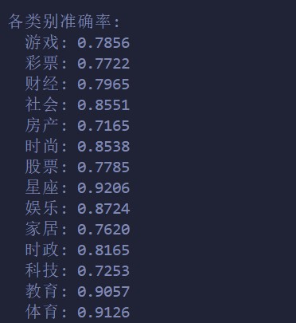

# 朴素贝叶斯分类算法

### 核心原理

贝叶斯分类器的灵魂在于**贝叶斯定理（Bayes' Theorem）**，它提供了一种通过先验概率和似然估计来计算后验概率的机制。在机器学习的语境下，就是在已知特征 $X$ 的前提下，反推该样本属于类别 $Y$ 的概率。

而**“朴素”（Naive）**二字，源于一个极其强势且理想化的假设：**条件独立性假设**。即假设在给定目标值时，各个特征之间是相互独立的。

---

### 数学推导

给定特征向量 $X = [x_1, x_2, ..., x_n]$ 和类别 $Y = c$，根据贝叶斯定理，后验概率计算如下：

$$P(Y=c|X) = \frac{P(X|Y=c)P(Y=c)}{P(X)}$$

由于对于所有的类别 $c$，分母 $P(X)$ 都是相同的，在比较大小时可以将其忽略，只求分子最大化：

$$Y_{predict} = \arg\max_{c} P(X|Y=c)P(Y=c)$$

引入**朴素假设**（特征条件独立），联合似然可以拆解为各个特征似然的连乘：

$$P(X|Y=c) = \prod_{i=1}^{n} P(x_i|Y=c)$$

假设特征服从**高斯分布（正态分布）**。对于类别 $c$ 中的第 $i$ 个特征，其概率密度函数为：

$$P(x_i|Y=c) = \frac{1}{\sqrt{2\pi\sigma_{c,i}^2}} \exp\left(-\frac{(x_i - \mu_{c,i})^2}{2\sigma_{c,i}^2}\right)$$

为了防止多个极小的概率值连乘导致**计算机浮点数下溢（Underflow）**，通常对两边取自然对数，将连乘转化为连加：

$$\log P(Y=c|X) \propto \log P(Y=c) + \sum_{i=1}^{n} \log P(x_i|Y=c)$$

这就是在代码中实际优化的数学目标。

---

### 代码实现

  
**具体实例**：使用朴素贝叶斯算法或其他相关方法，进行新闻标题文本分类，根据给出的新闻标题文本和标签训练一个分类模型，然后对测试集的新闻标题文本进行分类。 使用的是处理后的 THUCNews 数据集。THUCNews 是根据新浪新闻 RSS 订阅频道 2005~2011 年间的历史数据筛选过滤生成，包含 74 万篇新闻文档，均为 UTF-8 纯文本格式。在原始新浪新闻分类体系的基础上，重新整合划分出 14 个候选分类类别：财经、彩票、房产、股票、家居、教育、科技、
社会、时尚、时政、体育、星座、游戏、娱乐。 

朴素贝叶斯分类器：


```python
import numpy as np

class NaiveBayesClassifier:
    # vocab_size: 词汇表大小
    # priors: 类别的先验概率
    # likelihoods: 条件概率
    # classes: 类别列表
    def __init__(self,vocab_size):
        self.vocab_size = vocab_size
        self.priors = {}
        self.likelihoods = {}
        self.classes = []
    
    # 训练模型 朴素贝叶斯
    def fit(self, X, y):
        num = X.shape[0]
        self.classes = np.unique(y)
        # 初始化似然概率（拉普拉斯平滑）
        word_counts = np.ones((len(self.classes), self.vocab_size))
        for c in self.classes:
            # 计算先验概率
            c_samples = X[y == c]
            self.priors[c] = np.log(len(c_samples) / num)
            # 计算似然概率
            flat = c_samples.flatten()
            valid_words = flat[flat != 0]  # 排除填充的0
            for word in valid_words:
                word_counts[c, word] += 1
        total_counts = np.sum(word_counts, axis=1, keepdims=True)
        self.likelihoods = np.log(word_counts / total_counts)
    
    # 预测
    def predict(self, X_test):
        predictions = []
        for x in X_test:
            valid_words = x[x != 0]  # 排除填充的0
            posteriors = []
            for c in self.classes:
                prior = self.priors[c]
                likelihood = np.sum(self.likelihoods[c, valid_words])
                posteriors.append(prior + likelihood)
            predictions.append(np.argmax(posteriors))
        return np.array(predictions)

```

载入数据：

```python
import numpy as np
import os
class THUCNewsLoader:

    # max_length:指文本的最大长度
    # vocab:词汇表
    # idx_to_word:索引到词的映射
    # class_to_idx:类别到索引的映射
    def __init__(self, max_length=50):
        self.max_length = max_length
        self.vocab = {"<PAD>": 0, "<UNK>": 1}
        self.idx_to_word = {0: "<PAD>", 1: "<UNK>"}
        self.class_to_idx = {}
        self.idx_to_class = {}
    
    # 构建词汇表
    def build_vocab(self, texts):
        for text in texts:
            for word in text.strip():
                if word not in self.vocab:
                    idx = len(self.vocab)
                    self.vocab[word] = idx
                    self.idx_to_word[idx] = word
    
    # 将文本转换为索引
    def text_to_tensor(self, text):
        indices = [self.vocab.get(word, self.vocab["<UNK>"]) for word in text.strip()]
        # 如果索引列表长度小于max_length，则用<PAD>填充
        if len(indices) < self.max_length:
            indices.extend([self.vocab["<PAD>"]] * (self.max_length - len(indices)))
        # 如果索引列表长度大于max_length，则截断
        return indices[:self.max_length]
    
    # 从文件加载数据（文本\t标签格式）- 只负责读取数据
    def load_data(self, file_path):
        texts = []
        labels = []
        with open(file_path, 'r', encoding='utf-8') as f:
            for line in f:
                parts = line.strip().split('\t')
                if len(parts) == 2:
                    text, label = parts
                    texts.append(text)
                    labels.append(label)
        return texts, labels
    
    # 构建类别映射（从标签列表）
    def build_class_mapping(self, labels):
        unique_labels = set(labels)
        for label in unique_labels:
            if label not in self.class_to_idx:
                idx = len(self.class_to_idx)
                self.class_to_idx[label] = idx
                self.idx_to_class[idx] = label
    
    # 将标签转换为数字索引
    def labels_to_indices(self, labels):
        return np.array([self.class_to_idx[label] for label in labels])
```

测试结果：

{ width="310" }

---

### 算法分析

朴素贝叶斯的优势在于仅仅是统计频率和计算均值/方差，所以时间复杂度几乎是线性的，而且数据量极小的情况下，复杂的深度学习模型（如神经网络）会严重过拟合，而朴素贝叶斯由于其极其简单的假设，拥有很强的偏置，反而能给出极其稳定和鲁棒的结果。  


但从测试结果来看，准确率并不尽如人意，原因如下：  
1.朴素贝叶斯假设在给定类别的情况下，特征之间相互独立。但在新闻标题中，词序和词的组合蕴含了巨大的信息量。丢失了这些关联，模型的理解能力就会大打折扣。  
2.代码中对所有出现的词汇一视同仁。但在新闻中，“的”、“是”、“在”这种停用词出现频率极高但毫无分类价值，而“降息”、“夺冠”这类词出现频率低却极具决定性。  
3.新闻标题通常只有 10-20 个词，而在庞大的 vocab_size 中，绝大多数词的频次为 0。  
这便是朴素贝叶斯算法的局限性